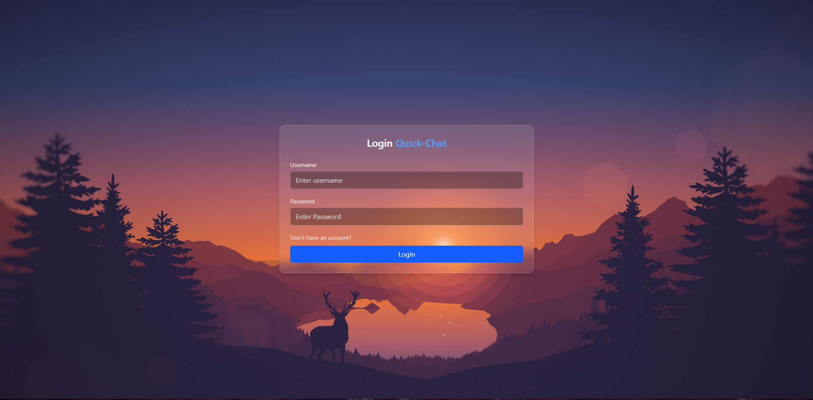
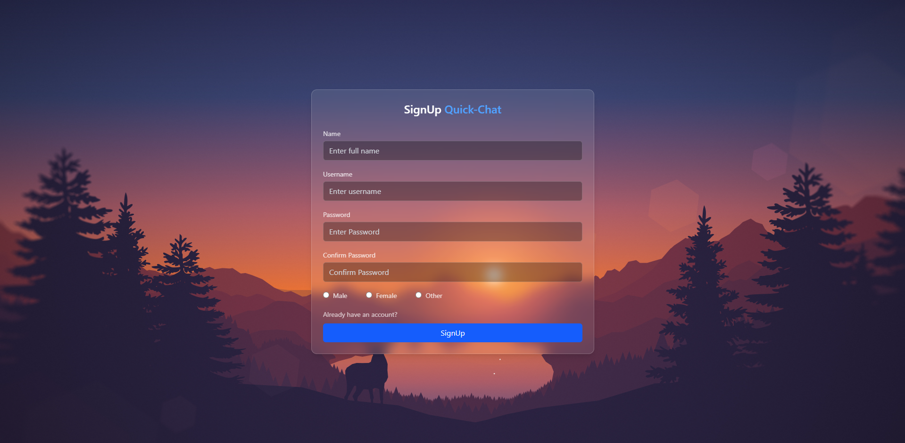
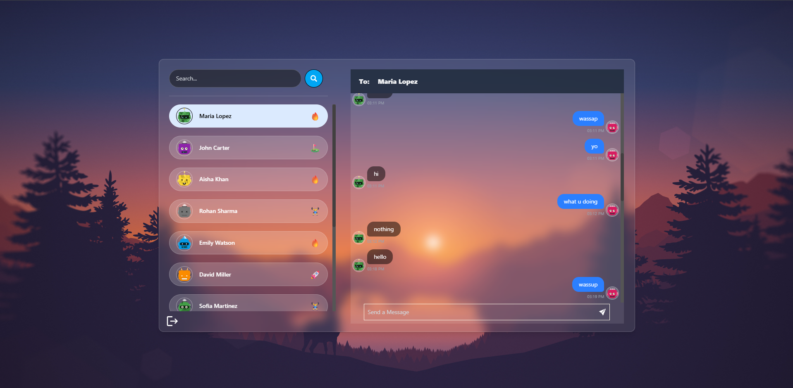
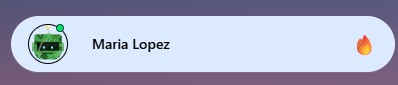

# 🚀 Quick-Chat

**Quick-Chat** is a real-time chat web app built using the **MERN stack + Socket.IO**.  
It supports secure authentication using **JWT Cookies**, live messaging, online user detection, and a modern UI.

---

## ✨ Features

✅ Signup / Login (JWT Cookie Authentication)  
✅ Logout (Cookie cleared securely)  
✅ Real-time messaging with Socket.IO  
✅ Online users indicator (green dot)  
✅ Chat bubbles UI + timestamps  
✅ Zustand for global state management  
✅ Toast notifications (`react-hot-toast`)  
✅ Responsive UI using Tailwind CSS  

---

## 🛠 Tech Stack

### Frontend
- React
- React Router DOM
- Zustand
- Tailwind CSS
- Socket.IO Client
- React Hot Toast

### Backend
- Node.js
- Express.js
- MongoDB + Mongoose
- Socket.IO Server
- JWT Cookies
- bcryptjs

---

## 📁 Project Structure

```
Quick-Chat/
│
├── backend/
│   ├── server.js
│   ├── routes/
│   ├── controllers/
│   ├── models/
│   └── socket/
│
├── frontend/
│   ├── src/
│   ├── Pages/
│   ├── Components/
│   ├── Hooks/
│   └── ZustandStore/
│
└── package.json
```

---

## ⚙️ Environment Variables

Create a `.env` file inside **backend/**:

```env
MONGO_URI=your_mongodb_url
JWT_SECRET=your_secret_key
PORT=3000
NODE_ENV=development
```

---

## 📦 Installation

```bash
git clone https://github.com/yourusername/quick-chat.git
cd quick-chat
npm install
npm install --prefix frontend
```


---

## 🚀 Future Improvements

✅ Typing indicator  
✅ Read receipts  
✅ Image sharing  
✅ Group chat  
✅ Message reactions  

---

## 📸 Screenshots

> Add these screenshots in a folder named `screenshots/` in your repo:

### 🔐 Login


### 📝 Signup


### 💬 Chat UI


### 🟢 Online Users Indicator



---

## 👨‍💻 Author

Made with ❤️ by **Mayank Singh**
